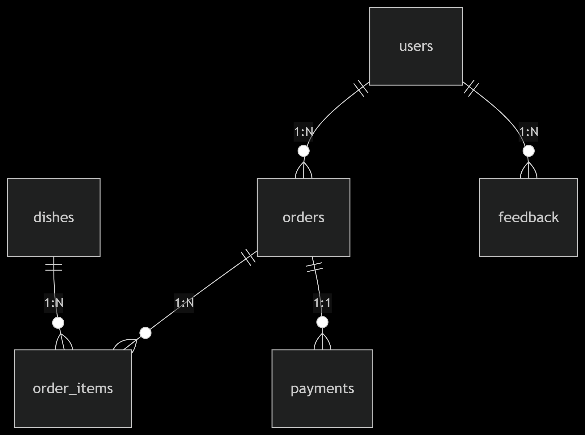

# 🍔 Система заказа еды (Telegram-бот)

Лёгкий и удобный чат-бот для Telegram, позволяющий пользователям:

- Просматривать меню ресторана с категориями блюд  
- Добавлять блюда в корзину и менять количество  
- Автоматически рассчитывать итоговую стоимость  
- Оформлять заказ и получать уведомления о статусе  
- Выбирать способ оплаты (онлайн или наличными — заглушка)  
- Оставлять отзывы о заказе

## 🚀 Технологии

- **Язык**: Python  
- **Библиотека**: pyTelegramBotAPI (telebot)  
- **База данных**: SQLite  
- **CI/CD**: GitHub Actions (lint, тесты)  


## 📌 Содержание
- [🚀 Быстрый старт](#-быстрый-старт)
- [⚙️ Установка](#-установка)
- [🗃 База данных](#-база-данных)
- [🧪 Тестирование](#-тестирование)
- [📂 Структура проекта](#-структура-проекта)
- [🔧 Для разработчиков](#-для-разработчиков)
- [❓ FAQ](#-faq)

---

## 🚀 Быстрый старт
1. Клонируйте репозиторий:
```
bash

git clone https://github.com/Olirniy/zero_food_bot.git
cd zero_food_bot
```
2. Прописать токен телеграм бота в переменных окружения или в .env файле

## ⚙️ Установка
#Обязательные зависимости
```
bash

pip install -r requirements.txt
pyTelegramBotAPI==4.12.0
SQLAlchemy==2.0.25
python-dotenv==1.0.0
pytest==8.1.1
```

## 🗃 База данных
__Инициализация__
```
bash

python init_storage.py
```

Последствия отсутствия инициализации БД
1.	Бот не запустится
При попытке доступа к БД вы получите ошибку:
2.	Отсутствие таблиц
В файле bot.db (или test.db) не будет создана структура таблиц, прописанная в db_session.py.

---
__Схема БД__

---
### __Основные таблицы__

Tables | Description

```users```  Пользователи (telegram_id, username)

```dishes```	Меню (название, цена, категория)

```orders``` 	Заказы (статус, payment_method)

```payments``` 	Платежи (amount, status)

```feedback``` 	Отзывы (text, created_at)


## 🧪 Тестирование

### CI/CD и "чистое тестирование"

```
bash
# В CI/CD-пайплайне (например, GitHub Actions)
pip install .          # Установка production-зависимостей 
                       # Код становится доступным как модуль `zero_food_bot`
pip install pytest pytest-cov  # Только инструменты тестирования
pytest --cov=./ tests/ # Запуск тестов
```


### Запуск тестов

```
bash

# Активировать тестовый режим
export TEST_MODE=1  # Linux/macOS
$env:TEST_MODE='1'  # Windows

# Запуск всех тестов
pytest tests/ -v

# С покрытием кода
pytest --cov=./ tests/
```

### __Фикстуры__ ```conftest.py```

```
# Основные фикстуры
test_db_path - путь к временной тестовой БД
db - изолированная тестовая БД с чистыми таблицами
clean_tables - автоматическая очистка таблиц перед тестами

# Тестовые данные
sample_user - тестовый пользователь (telegram_id=12345)
sample_dish - тестовое блюдо (price=10.0)
sample_order - заказ с мок-данными (status=IN_CART)

# Storage-слои
order_item_storage - низкоуровневый доступ к order_items
order_storage - низкоуровневый доступ к orders
payment_storage - низкоуровневый доступ к payments

# Repository-слои
order_item_repo - бизнес-логика для позиций заказа
order_repo - бизнес-логика для заказов (с зависимостями)
payment_repo - бизнес-логика для платежей
```

## 📂 Структура проекта

```
├── LICENSE                     # Лицензия проекта (MIT)
├── README.md                   # Документация проекта
├── bot.db                      # Основная база данных SQLite
├── config.json                 # Конфигурационные параметры
├── config.py                   # Загрузчик конфигурации
├── init_storage.py             # Инициализатор БД
├── log_funcs.py                # Функции логирования
├── main.py                     # Точка входа бота
├── requirements.txt            # Зависимости проекта
├── setup.py                    # Конфигурация Python-пакета

### Модели данных (models/)
├── models/
│   ├── __init__.py             # Инициализация пакета
│   ├── category.py             # Модель категорий блюд
│   ├── dish.py                 # Модель блюд
│   ├── enums.py                # Перечисления (статусы заказов)
│   ├── feedback.py             # Модель отзывов
│   ├── order.py                # Модель заказов
│   ├── order_item.py           # Модель позиций заказа
│   ├── payment.py              # Модель платежей
│   └── user.py                 # Модель пользователей

### Бизнес-логика (repository/)
├── repository/
│   ├── __init__.py
│   ├── category_repo.py        # Логика работы с категориями
│   ├── dish_repo.py            # Логика работы с блюдами
│   ├── feedback_repo.py        # Логика работы с отзывами
│   ├── order_item_repo.py      # Логика позиций заказа
│   ├── order_repo.py           # Логика заказов
│   ├── payment_repo.py         # Логика платежей
│   └── user_repo.py            # Логика пользователей

### Работа с БД (storage/)
├── storage/
│   ├── __init__.py
│   ├── category_storage.py     # SQL-запросы для категорий
│   ├── db_session.py           # Управление подключениями к БД
│   ├── db_utils.py             # Вспомогательные функции БД
│   ├── dish_storage.py         # SQL-запросы для блюд
│   ├── feedback_storage.py     # SQL-запросы для отзывов
│   ├── order_items_storage.py  # SQL-запросы для позиций заказа
│   ├── order_storage.py        # SQL-запросы для заказов
│   ├── payment_storage.py      # SQL-запросы для платежей
│   └── user_storage.py         # SQL-запросы для пользователей

### Тесты (tests/)
├── tests/
│   ├── __init__.py
│   ├── conftest.py             # Фикстуры pytest
│   ├── test_dishes.py          # Тесты блюд
│   ├── test_feedback.py        # Тесты отзывов
│   ├── test_order_items.py     # Тесты позиций заказа
│   ├── test_orders.py          # Тесты заказов
│   ├── test_payments.py        # Тесты платежей
│   ├── test_user.py            # Тесты пользователей
│   └── test_user_storage.py    # Тесты user_storage
```
## 🔧 Для разработчиков

### Ключевые зависимости

```
bash

# Установка проекта со всеми dev-зависимостями (включая pytest)
pip install -e .[dev]
```

### Работа с миграциями

#### При изменении моделей:
* Удалите старую БД (bot.db)

* Пересоздайте структуру:
```
bash

python init_storage.py
```

## ❓ FAQ

* #### Q: Как сбросить автоинкрементные ID?
```
SQL

-- Для тестовой БД
UPDATE sqlite_sequence SET seq=0 WHERE name='users';
```

* #### Q: Тесты падают с ошибкой "No such table"?

  * Убедитесь, что активирован тестовый режим (TEST_MODE=1)

  * Проверьте, что фикстура db создает таблицы

* #### Q: Как добавить новое поле в модель?

  * Измените модель в models/

  * Обновите соответствующий Storage-класс

  * Запустите миграцию (см. раздел выше)

---
## 📜 Лицензия


